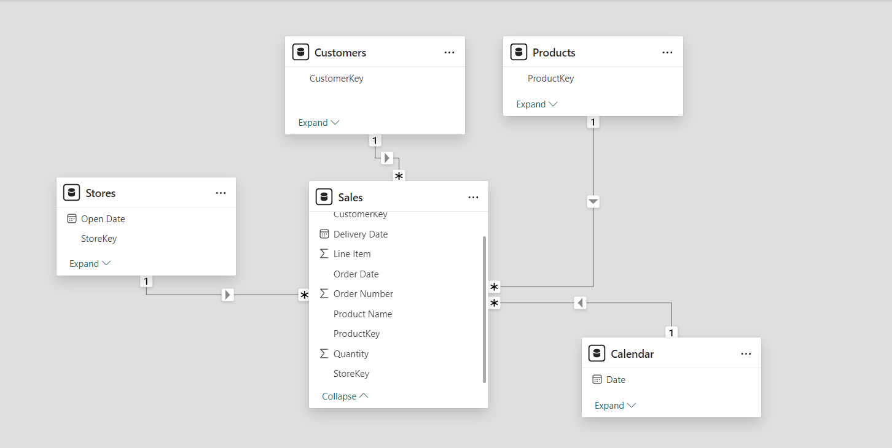
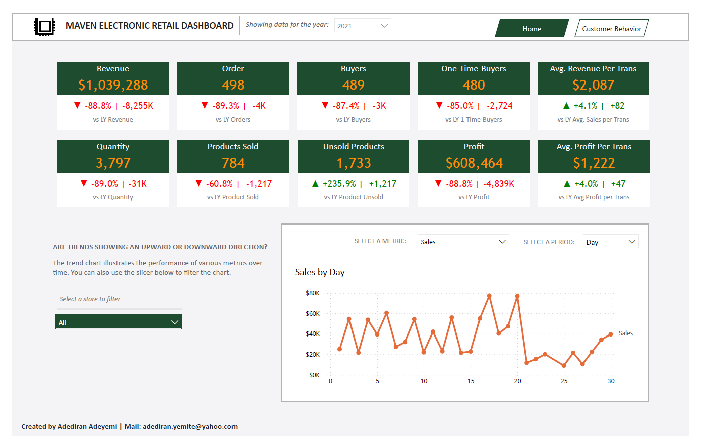
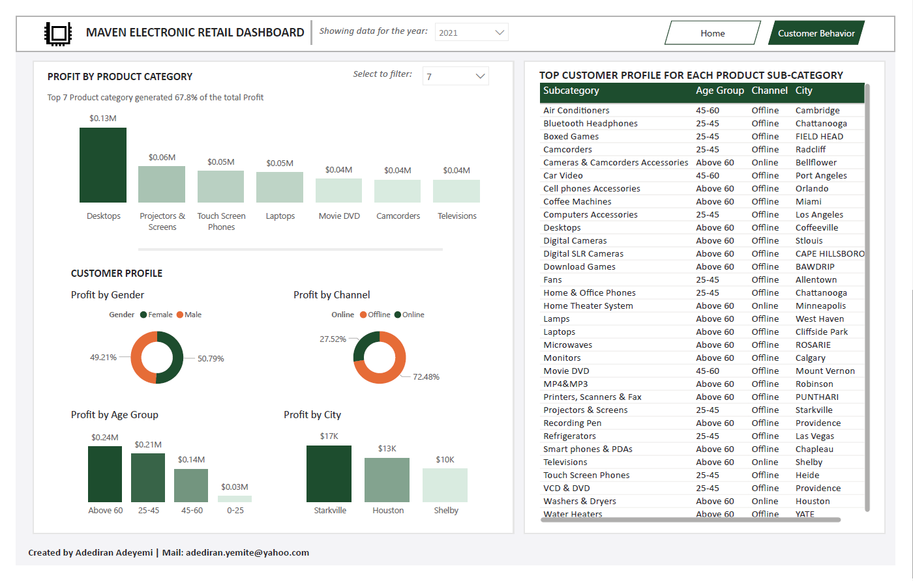

# Global Electronic Retail Store Performance Analysis

## Table of Contents
- [Background Overview](#background-overview)
- [Executive Summary](#executive-summary)
- [Data Model](#data-model)
- [Measures](#measures)
- [Calculated Tables](#calculated-tables)
- [Insights](#insights)
- [Conclusions and Recommendations](#conclusions-and-recommendations)

## Background Overview
Since 2020, a global electronics retailer specializing in products such as computers, cell phones, and TVs has faced a consistent decline in revenue. To address this issue, management required a data-driven solution to understand what factors were driving the drop in sales and identify key opportunities for improvement.

The solution provided centers on a comprehensive dashboard designed to track performance metrics, analyze trends, and offer actionable insights.

## Executive Summary
The sales performance dashboard delivers critical insights that help the business understand:
- **Why revenue has dropped**: Identifying shifts in customer behavior and product performance.
- **What products are currently being purchased**: Highlighting trends in high-performing and underperforming categories.
- **Who is buying these products**: Detailed customer segmentation by demographics.
- **The best channels to reach customers**: Analyzing the effectiveness of online and offline sales channels.

By tracking these factors, the business can pinpoint areas for intervention and strategic improvement.
You calso view the Dashboard live [here](https://app.powerbi.com/view?r=eyJrIjoiNzY0YzRiOTEtZmU0Yy00YWRjLWJhYjYtNTE1YjNjYTVjYmVkIiwidCI6IjQyOWYxMWVhLWM3NmQtNDczMS05M2M5LWM0MDZiNGYzMmE1YSJ9)

## Data Model

The data model for this analysis consists of five main tables:
1. **Sales**: Tracks all sales transactions.
2. **Stores**: Contains store-specific information.
3. **Customers**: Captures customer details.
4. **Products**: Contains product-related data.
5. **Calendar**: Holds time-series data.

The relationships between the tables are established as follows:
- **Sales[StoreKey]** to **Stores[StoreKey]** (Many-to-One)
- **Sales[Order Date]** to **Calendar[Date]**
- **Sales[ProductKey]** to **Products[ProductKey]**
- **Sales[CustomerKey]** to **Customers[CustomerKey]**

This model provides a solid foundation for analyzing sales trends across different stores, time periods, and customer segments.

## Measures
The following measures were created to evaluate the performance of key business metrics:

1. **Sales Measure**: This measure calculates total sales by multiplying the quantity sold with the unit price for each product
- Sales = SUMX(Sales, Sales[Quantity] * RELATED(Products[Unit Price USD]))

2. **Sub-year Sales KPI**: Provides a summary of the year-on-year sales percentage, year variance in thousands, and indicates trends with arrows
- Sub_y sales kpi = 
VAR year_diff = [Year_Variance]
VAR yoy = ([Sales] - [LY Sales]) / [LY Sales]
VAR year_diff_thousand = year_diff / 1000 /* Convert to thousands */
VAR _sign = IF(year_diff > 0, "+", "")
VAR sign_trend = IF(year_diff > 0, "▲", "▼")
RETURN sign_trend & " " & _sign & FORMAT(yoy, "#0.0%") & " | " & _sign & FORMAT(year_diff_thousand, "#,0K")

3. **Year Variance**: This measure calculates the variance between the current year's sales and last year's sales.
- Year_Variance = [Sales] - [LY Sales]

4. **YoY Sales Percentage**: Calculates the year-over-year (YoY) percentage change in sales and displays a trend indicator (▲ or ▼). 
- YoY Sales % = 
VAR _variance = [Sales] - [LY Sales]
VAR _pct = DIVIDE(_variance, [LY Sales])
RETURN FORMAT(_pct, "0%") & IF(_pct > 0, " ▲", " ▼")

5. **Sales KPI**: This measure formats the sales value for display, using thousand separators and currency symbols.
- KPI Sales = FORMAT([Sales], "$#,0") & ""

6. **Last Year Sales**: Retrieves sales from the previous year for comparison purposes.
- LY Sales = CALCULATE([Sales], PREVIOUSYEAR('Calendar'[Date]))

7. **Color LY Sales**: Determines the color (Red/Green) based on whether the sales growth compared to last year is negative or positive.
- color LY sales = 
VAR YoY_growth = DIVIDE([Year_Variance], [LY Sales])
RETURN IF(YoY_growth < 0, "Red", "Green")

8. **Quantity Measure**: Calculates the total quantity of products sold.
- Quantity = SUM(Sales[Quantity])

9. **Sub-year Quantity KPI**: Shows the year-on-year quantity changes with trend indicators and year variance in thousands.
- Sub_y quantity kpi = 
VAR year_diff = [Quantity] - [LY Quantity]
VAR yoy = ([Quantity] - [LY Quantity]) / [LY Quantity]
VAR year_diff_thousand = year_diff / 1000 /* Convert to thousands */
VAR _sign = IF(year_diff > 0, "+", "")
VAR sign_trend = IF(year_diff > 0, "▲", "▼")
RETURN sign_trend & " " & _sign & FORMAT(yoy, "#0.0%") & " | " & _sign & FORMAT(year_diff_thousand, "#,0K")

10. **Last Year Quantity**: Retrieves the total product quantity sold last year. 
- LY Quantity = CALCULATE([Quantity], PREVIOUSYEAR('Calendar'[Date]))

11. **Profit Measure**: Calculates the total profit by subtracting the cost from the sales.
- Profit = [Sales] - [Cost]

12. **Cost Measure**: This measure calculates the total cost by multiplying the quantity with the unit cost for each product.
- Cost = SUMX(Sales, Sales[Quantity] * RELATED(Products[Unit Cost USD]))

13. **Profit KPI**: Formats the total profit for display with currency symbols and thousand separators.
- KPI Profit = FORMAT([Profit], "$#,0") & ""

14. **Last Year Profit**: Retrieves the profit from the previous year for comparison purposes.
- LY Profit = CALCULATE([Profit], PREVIOUSYEAR('Calendar'[Date]))

15. **Sub-year Profit KPI**: Displays the year-on-year profit variance and percentage change with trend indicators.
- Sub_y profit kpi = 
VAR year_diff = [Profit] - [LY Profit]
VAR yoy = ([Profit] - [LY Profit]) / [LY Profit]
VAR year_diff_thousand = year_diff / 1000 /* Convert to thousands */
VAR _sign = IF(year_diff > 0, "+", "")
VAR sign_trend = IF(year_diff > 0, "▲", "▼")
RETURN sign_trend & " " & _sign & FORMAT(yoy, "#0.0%") & " | " & _sign & FORMAT(year_diff_thousand, "#,0K")

16. **Color LY Profit**: Assigns a color (Red/Green) based on whether profit growth compared to last year is negative or positive.
- color LY Profit = 
VAR YoY_growth = DIVIDE([Profit] - [LY Profit], [LY Profit])
RETURN IF(YoY_growth < 0, "Red", "Green")

17. **Unsold Products**: Calculates the number of products that were unsold
- Unsold Products = [Total products] - [Product Sold]

18. **Sold Products**: Counts the total distinct products sold.
- Product Sold = DISTINCTCOUNT(Sales[ProductKey])

19. **Sub-year Unsold Product KPI**: Shows the year-on-year unsold product changes with trend indicators and year variance.
- Sub_y Unsold Product kpi = 
VAR year_diff = [Unsold Products] - [LY Unsold Products]
VAR yoy = ([Unsold Products] - [LY Unsold Products]) / [LY Unsold Products]
VAR year_diff_thousand = year_diff / 1000 /* Convert to thousands */
VAR _sign = IF(year_diff > 0, "+", "")
VAR sign_trend = IF(year_diff > 0, "▲", "▼")
RETURN sign_trend & " " & _sign & FORMAT(yoy, "#0.0%") & " | " & _sign & FORMAT(year_diff, "#,0")

20. **Rank Product by Profit**: Ranks products based on the total profit generated, with higher profits receiving better ranks.
- Rank Product by Profit = RANKX(ALL(Products[Subcategory]), [Profit], , DESC)

21. **Average Profit per Transaction**: Calculates the average profit per transaction.
- Avg Profit Per Trans = AVERAGEX(VALUES(Sales[Order Number]), [Profit])

22. **Average Sales per Transaction**: Calculates the average sales revenue per transaction.
- Avg Revenue Per Trans = AVERAGEX(VALUES(Sales[Order Number]), [Sales])

23. **Sub-year Average Profit per Transaction KPI**: Displays year-on-year changes in average profit per transaction, with trend indicators and year variance.
- Sub_y Avg Profit per Trans kpi = 
VAR year_diff = [Avg Profit Per Trans] - [LY Avg Profit per Trans]
VAR yoy = ([Avg Profit Per Trans] - [LY Avg Profit per Trans]) / [LY Avg Profit per Trans]
VAR year_diff_thousand = year_diff / 1000 /* Convert to thousands */
VAR _sign = IF(year_diff > 0, "+", "")
VAR sign_trend = IF(year_diff > 0, "▲", "▼")
RETURN sign_trend & " " & _sign & FORMAT(yoy, "#0.0%") & " | " & _sign & FORMAT(year_diff, "#,0")

24. **Sub-year Order KPI**: Displays year-on-year changes in the number of orders, with trend indicators and year variance.
- Sub_y order kpi = 
VAR year_diff = [Order] - [LY Order]
VAR yoy = ([Order] - [LY Order]) / [LY Order]
VAR year_diff_thousand = year_diff / 1000 /* Convert to thousands */
VAR _sign = IF(year_diff > 0, "+", "")
VAR sign_trend = IF(year_diff > 0, "▲", "▼")
RETURN sign_trend & " " & _sign & FORMAT(yoy, "#0.0%") & " | " & _sign & FORMAT(year_diff, "#,0")

25. **Title Measure**: Provides information about the top N product subcategories in terms of profit
- Title =
    VAR TopSubCat = 
        CALCULATE(
            [Profit],
            TOPN(
                SELECTEDVALUE('Top N'[Top N]),
                ALLSELECTED(Products[Subcategory]),
                [Profit]
            )
        )
    VAR TopSubCatPct = 
        DIVIDE(
            TopSubCat,
            [Profit]
        )
    RETURN
    "Top " & SELECTEDVALUE('Top N'[Top N]) & " Product Sub-category generated " & FORMAT(TopSubCatPct, "#.#% of the total Profit")     

26. **Top Age Group**: Identifies the top age group based on profit.
- Top Age group = 
    MAXX(
        TOPN(
            1, 
            SUMMARIZE(Customers, Customers[Age Group], "Prof", [Profit]),
            [Prof], 
            DESC
        ),
        Customers[Age Group]
    )

27. **Top Channel**: Determines the top sales channel based on profit.
- top channel = 
    MAXX(
        TOPN(
            1, 
            SUMMARIZE(Stores, Stores[Online], "Prof", [Profit]),
            [Prof], 
            DESC
        ),
        Stores[Online]
    )

28. **Top City**: Finds the city with the highest profit.
- top city = 
    MAXX(
        TOPN(
            1, 
            SUMMARIZE(Customers, Customers[City], "Prof", [Profit]),
            [Prof], 
            DESC
        ),
        Customers[City]
    )

29. **Top Gender**: Identifies the gender with the highest profit.
- top Gender = 
    MAXX(
        TOPN(
            1, 
            SUMMARIZE(Customers, Customers[Gender], "Prof", [Profit]),
            [Prof], 
            DESC
        ),
        Customers[Gender]
    )

30. **Year**: Retrieves the selected year from the Calendar table
- year = SELECTEDVALUE('Calendar'[Year])

31. **Buyers Measure**: Counts the distinct number of buyers (customers) in the sales data.
- Buyers = DISTINCTCOUNT(Sales[CustomerKey])

32. **Color LY Customers**: Determines the color (Red/Green) based on whether the number of buyers has decreased or increased compared to last year.
- color LY customer = 
VAR YoY_growth = DIVIDE([Buyers] - [LY customers], [LY customers])
RETURN IF(YoY_growth < 0, "Red", "Green")

33. **Color LY One-Time Customers**: Assigns a color based on the change in one-time buyers compared to last year.
- color LY one-time customer = 
VAR YoY_growth = DIVIDE([One-Time-Buyers] - [LY one time customers], [LY one time customers])
RETURN IF(YoY_growth < 0, "Red", "Green")

34. **Customer Rank by Profit**: Ranks customers based on the total profit they have generated. 
- Customer Rank by Profit = 
    RANKX(
        ALL(Sales[CustomerKey]), 
        [Profit], 
        , 
        DESC, 
        Dense
    )

35. **KPI Buyers**: Formats the number of buyers for display.
- KPI Buyers = FORMAT([Buyers], "#,0") & ""

36. **KPI One-Time Buyers**: Formats the number of one-time buyers for display 
- KPI One-Time-Buyers = FORMAT([One-Time-Buyers], "#,0") & ""

37. **Last Year Customers**: Retrieves the number of buyers from the previous year.
- LY customers = CALCULATE([Buyers], PREVIOUSYEAR('Calendar'[Date]))

38. **Last Year One-Time Customers**: Retrieves the number of one-time buyers from the previous year.
- LY one time customers = CALCULATE([One-Time-Buyers], PREVIOUSYEAR('Calendar'[Date]))

39. **One-Time Buyers**: Counts the number of customers who made only one purchase.
- One-Time-Buyers = 
    COUNTROWS(
        FILTER(
            SUMMARIZE(Sales, Customers[CustomerKey], "Total Purchases", [Order]),
            [Total Purchases] = 1
        )
    )

40. **Sub-year Customer KPI**: Displays the year-on-year changes in the number of buyers with trend indicators and variance
- Sub_y customer kpi = 
    VAR year_diff = [Buyers] - [LY customers]
    VAR yoy = ([Buyers] - [LY customers]) / [LY customers]
    VAR year_diff_thousand = year_diff / 1000 /* Convert to thousands */
    VAR _sign = IF(year_diff > 0, "+", "")
    VAR sign_trend = IF(year_diff > 0, "▲", "▼")
    RETURN
        sign_trend & " " & _sign & FORMAT(yoy, "#0.0%") & " | " & _sign & FORMAT(year_diff_thousand, "#,0K")

41. **Sub-year One-Time Customer KPI**: Shows the year-on-year changes in one-time buyers with trend indicators and variance.
- Sub_y one time customer = 
    VAR year_diff = [One-Time-Buyers] - [LY one time customers]
    VAR yoy = ([One-Time-Buyers] - [LY one time customers]) / [LY one time customers]
    VAR year_diff_thousand = year_diff / 1000 /* Convert to thousands */
    VAR _sign = IF(year_diff > 0, "+", "")
    VAR sign_trend = IF(year_diff > 0, "▲", "▼")
    RETURN
        sign_trend & " " & _sign & FORMAT(yoy, "#0.0%") & " | " & _sign & FORMAT(year_diff, "#,0")

## Calculated Tables
The following calculated tables were created:

1. **Calendar Table**: Creates a calendar table with various date-related columns for time intelligence.
- Calendar = 
    ADDCOLUMNS (
        CALENDAR(
            DATE(YEAR(MIN('Sales'[Order Date])), 1, 1),
            DATE(YEAR(MAX('Sales'[Order Date])), 12, 31)
        ),
        "Year", YEAR([Date]),
        "Quarter", "Q" & QUARTER([Date]),
        "Month", FORMAT([Date], "mmmm"),
        "Month Number", MONTH([Date]),
        "Week Number", WEEKNUM([Date]),
        "M", FORMAT([Date], "mmm"),
        "Week", FORMAT([Date], "dddd"),
        "Month Year", FORMAT([Date], "MMM YYYY"),
        "Day", DAY([Date])  /* New column for Day of the month */
    )

2. **Date Dimensions**: Defines a set of date dimensions for use in slicers or filters.
- dDate = {
    ("Quarter", NAMEOF('Calendar'[Quarter]), 0),
    ("Month", NAMEOF('Calendar'[Month]), 1),
    ("Week", NAMEOF('Calendar'[Week]), 2),
    ("Day", NAMEOF('Calendar'[Day]), 3)
}

3. **Measures Selection**: Lists the available measures for dynamic selection in reports.
- Measures Selection = {
    ("Sales", NAMEOF('Sales measure'[Sales]), 0),
    ("Avg Profit Per Trans", NAMEOF('Orders measure'[Avg Profit Per Trans]), 1),
    ("Avg Sales Per Trans", NAMEOF('Orders measure'[Avg Revenue Per Trans]), 2),
    ("Order", NAMEOF('Orders measure'[Order]), 3),
    ("Buyers", NAMEOF('customers measure'[Buyers]), 4),
    ("One-Time-Buyers", NAMEOF('customers measure'[One-Time-Buyers]), 5),
    ("Quantity", NAMEOF('Quantity measures'[Quantity]), 6),
    ("Profit", NAMEOF('Profit measure'[Profit]), 7)
}

4. **Top N Table**: Generates a series from 0 to 20 to be used for selecting the top N items.
- Top N = GENERATESERIES(0, 20, 1)

## Insights

### First Page: Key Performance Indicators (KPIs)
To assess the reasons behind the revenue decline, I tracked the following KPIs, comparing 2021 to the previous year:
- **One-time buyers**: 480 buyers, down by 2,724 (-85% YoY).
- **Number of orders**: 498, down by 4,000 (-89.3% YoY).
- **Total revenue**: $1,039,288, down by $8.25M (-88.8% YoY).
- **Quantity sold**: 3,797 items, down by 31,000 (-89% YoY).
- **Profit**: $608,464, down by $4.8M (-88.8% YoY).
- **Products sold**: 784 different items, down by 1,217 (-60.8% YoY).
- **Products without sales**: 1,733 unsold items, an increase of 1,217 (+235.9% YoY).
- **Average revenue per transaction**: $2,087, up by $82 (+4.1% YoY).
- **Average profit per transaction**: $1,222, up by $47 (+4.0% YoY).

### Second Page: Customer Behavior Insights

In addition to the KPIs, the dashboard provides a deep dive into customer purchasing behavior, highlighting:
- **Top product categories**: The most profitable product categories in 2021 were Desktops ($0.13M), Projectors and Screens ($0.06M), Touch Screen Phones ($0.05M), and Laptops ($0.05M), among others. These categories accounted for 67.8% of the total profit.
  
- **Customer profiles**:
- Gender: Males contributed 50.79% of total profit, females contributed 49.21%.
- Profit by city: Starkville ($17k), Houston ($13k), and Shelby ($10k) were the top-performing cities.
- Profit by age group: The above 60 group led with $0.24M, followed by the 45-60 group ($0.14M) and the 25-45 group ($0.12M).
- 
- **Sales channels**: The vast majority of sales (72.48%) occurred offline, with 27.52% taking place through online channels.
  
### Sales Trends:
- **Revenue Decline**: The store has experienced a consistent year-over-year decline in sales revenue since 2020, primarily driven by reduced product sales and fewer orders.
- **Product Performance**: The top-selling products continue to generate the highest revenue, but several product categories have seen declining sales. Unsold product levels have increased, indicating inefficiencies in inventory management.
- **Customer Behavior**: The number of new buyers has decreased, and there has been a significant rise in one-time buyers, indicating lower customer retention rates.

### Profitability:
- **Declining Profit Margins**: Year-over-year profit margins have shrunk, largely due to rising costs and stagnant sales. Key product lines that used to drive profit are now underperforming.
- **Top Performing Products**: Certain high-revenue products, especially in the electronics category, are still profitable, but the overall performance is being dragged down by underperforming items.

### Store Performance:
- **Geographic Insights**: Some regions have seen better sales performance than others. Urban areas generally show higher sales volumes, while rural stores are underperforming.

## Conclusions and Recommendations

1. **Focus on High-Performing Products**: 
   - Prioritize inventory management to ensure stock availability for top-selling products.
   - Discontinue or reduce stock for underperforming items.

2. **Customer Retention Strategies**:
   - Implement targeted marketing campaigns aimed at retaining customers and reducing the number of one-time buyers.
   - Consider loyalty programs or personalized offers based on past purchase behavior.

3. **Optimize Store Operations**:
   - Certain stores, particularly in rural areas, are not performing well.
   - Consider optimizing the product mix for these locations or even consolidating stores in underperforming regions.

4. **Enhance Digital Presence**:
   - With e-commerce becoming increasingly critical, invest more in the online sales channel.
   - Focus on enhancing user experience, promoting top products online, and leveraging digital marketing.

5. **Cost Management**:
   - Rising costs are eating into profit margins.
   - Identify cost-saving opportunities in the supply chain, inventory management, and operational processes.

---

By focusing on these strategic areas, the store can halt its revenue decline and return to growth in the coming years.
